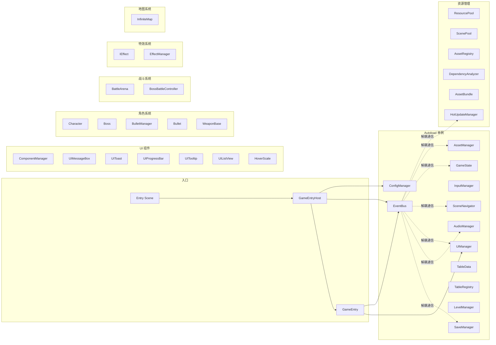

# 技术框架文档（TECH_FRAMEWORK）

## 1. 概述

- **目标**：为 Godot 项目提供可复用的游戏框架层，实现事件通信、存档、音频、输入、UI、场景、配置与游戏状态的统一管理，并与业务代码解耦。
- **适用**：Godot 4.x 项目，GDScript；业务代码放在 `game/`，框架代码放在 `framecore/`。
- **技术栈**：Godot 4.6、GDScript、Autoload 单例、ConfigFile/JSON 持久化、EventBus 信号。

---

## 2. 架构图



- **GameEntryHost** 作为框架层 Autoload，负责框架初始化和业务入口调用。
- **GameEntry** 作为业务层入口，实现业务初始化逻辑（如注册 UI、打开初始界面）。
- **EventBus** 作为中枢，各模块与业务通过 `EventBus.xxx.connect()` / `EventBus.xxx.emit()` 解耦。
- **ConfigManager** 提供 `user://settings.cfg` 持久化；**SaveManager** 负责 `user://saves/` 下多档位 JSON 存档。
- **SceneNavigator** 封装 scene_manager 插件，提供场景切换与过渡动画；**UIManager** 管理界面栈与打开/关闭。
- **GameState** 维护全局状态（MENU/PLAYING/PAUSED 等），并通过 EventBus 发送 `game_state_changed`。
- **AssetManager** 统一资源管理入口，整合加载/卸载/缓存/引用计数；**HotUpdateManager** 支持版本检查、断点续传下载、PCK动态加载。
- **Character** 角色基类，**Boss** Boss 基类，**BulletManager** 子弹管理器。
- **BattleArena** 战斗场景管理，**BossBattleController** Boss 战斗控制器。
- **EffectManager** 特效管理器，**InfiniteMap** 无限地图系统。

---

## 3. 目录约定

| 目录 | 用途 |
|------|------|
| **framecore/** | 框架代码：所有 Autoload 单例脚本、入口 `entry.gd`、资源池系统、角色系统、战斗系统、特效系统。不放置具体玩法逻辑。 |
| **framecore/asset/** | 资源管理系统：`IPoolable` 接口、`ResourcePool` 资源缓存池、`ScenePool` 场景池、`AssetBundle` 资源包、`AssetManager` 资源管理器、`AssetBundleBuilder` 打包工具、`HotUpdateManager` 热更新管理器、`DependencyAnalyzer` 依赖分析器、`AssetRegistry` 资源注册表。 |
| **framecore/component/** | UI 组件系统：`UIComponent` 组件基类、`ComponentManager` 组件管理器、`UIMessageBox`、`UIToast`、`UIProgressBar`、`UITooltip`、`UIListView`、`HoverScale`、`ButtonSound`。 |
| **framecore/ui/** | UI 管理系统：`UIManager` 界面管理器、`UIPanel` 面板基类、`UIKey` 标识符类、`UIKeys` 集中管理类、`HealthBar` 血条组件。 |
| **framecore/character/** | 角色系统：`Character` 角色基类、`Boss` Boss 基类、`BulletManager` 子弹管理器、`Bullet` 子弹基类、`WeaponBase` 武器基类。 |
| **framecore/battle/** | 战斗系统：`BattleArena` 战斗场景、`BossBattleController` Boss 战斗控制器。 |
| **framecore/effect/** | 特效系统：`IEffect` 特效接口、`EffectManager` 特效管理器。 |
| **framecore/map/** | 地图系统：`InfiniteMap` 无限地图。 |
| **framecore/interfaces/** | 接口定义：`IGameEntry` 游戏入口接口。 |
| **game/** | 业务代码：主菜单、关卡、角色、玩法脚本等。 |
| **game/map/** | 场景脚本（.gd），按模块划分子目录，命名遵循 `XXXScene.gd` 规范。 |
| **game/ui/** | 业务 UI 脚本（.gd），按模块划分子目录，命名遵循 `UIXXXPanel.gd` 规范。 |
| **game/boss/** | Boss 业务脚本。 |
| **resources/** | 框架与业务共用资源（如默认配置、公共素材）。 |
| **resources/tables/** | 配置表文件（JSON 格式）：`levels.json`、`bosses.json`、`characters.json`、`items.json`。 |
| **resources/map/** | 场景预制体（.tscn），按模块划分子目录。 |
| **resources/ui/** | UI 场景资源（.tscn），按模块划分子目录。 |
| **resources/components/** | UI 组件预制体（.tscn）。 |
| **docs/** | 项目文档。 |

---

## 4. 模块列表与职责

### 4.1 核心模块（Autoload）

| 模块 | 单例名 | 职责 | 依赖 |
|------|--------|------|------|
| EventBus | `EventBus` | 全局信号定义与派发，模块间解耦 | 无 |
| ConfigManager | `ConfigManager` | 画质、音量等设置持久化（user://settings.cfg） | 无 |
| GameState | `GameState` | 全局游戏状态枚举与切换，并广播事件 | EventBus |
| SaveManager | `SaveManager` | 多档位存档/读档（user://saves/，JSON） | EventBus |
| AudioManager | `AudioManager` | BGM/SE 统一播放与音量控制 | ConfigManager, EventBus |
| InputManager | `InputManager` | 输入动作封装，便于键位/手柄抽象与后续重映射 | 无 |
| SceneNavigator | `SceneNavigator` | 场景切换适配器，封装 scene_manager 插件 | EventBus |
| UIManager | `UIManager` | 界面栈、open/close/back，与 SceneManager 配合 | EventBus |
| AssetManager | `AssetManager` | 统一资源管理入口，整合加载/卸载/缓存/引用计数 | EventBus |
| TableData | `TableData` | 表格数据管理器，加载/解析 JSON，提供缓存和查询 API | AssetManager |
| TableLoader | `TableLoader` | CSV 解析器（保留兼容） | 无 |
| TableRegistry | `TableRegistry` | 表格注册表，管理预加载的表格列表 | TableData |
| LevelManager | `LevelManager` | 关卡管理器，管理关卡数据、进度、通关和解锁 | TableData, SaveManager |

### 4.2 资源管理模块

| 模块 | 职责 | 依赖 |
|------|------|------|
| IPoolable | 可池化对象接口，定义对象池生命周期回调 | 无 |
| ResourcePool | 资源缓存池，缓存已加载的资源，支持同步/异步加载 | EventBus |
| ScenePool | 场景池，预加载场景，实现快速切换 | EventBus |
| AssetBundle | 资源包定义，管理资源包元信息和版本 | 无 |
| AssetRegistry | 资源注册表，管理资源元信息和引用计数 | 无 |
| DependencyAnalyzer | 依赖分析器，分析资源依赖关系，检测循环依赖 | 无 |
| AssetBundleBuilder | 资源打包工具，支持分包策略和加密打包 | 无 |
| HotUpdateManager | 热更新管理器，支持版本检查、断点续传下载、PCK加载 | EventBus |

### 4.3 UI 组件模块

| 模块 | 职责 | 依赖 |
|------|------|------|
| UIComponent | UI 组件基类，定义组件的通用生命周期和行为 | 无 |
| ComponentManager | 组件管理器，统一管理组件实例和生命周期 | 无 |
| UIMessageBox | 模态对话框组件，支持确认/警告/自定义按钮 | EventBus |
| UIToast | 轻量级消息提示组件，支持队列和自动消失 | EventBus |
| UIProgressBar | 进度条组件，支持平滑动画和自定义样式 | 无 |
| UITooltip | 悬浮提示组件，支持鼠标跟随和目标跟随 | 无 |
| UIListView | 虚拟化列表组件，支持大量数据高效渲染 | EventBus |
| HoverScale | 悬停放大组件，鼠标进入时放大，移出时还原大小 | 无 |
| ButtonSound | 按钮音效组件，点击时播放音效 | 无 |
| HealthBar | 血条组件，显示角色/Boss 生命值 | 无 |

### 4.4 角色系统模块

| 模块 | 职责 | 依赖 |
|------|------|------|
| Character | 角色基类，提供移动、生命值、攻击等基础功能 | 无 |
| Boss | Boss 基类，继承 Character，提供 Boss 特有行为 | Character |
| BulletManager | 子弹管理器，管理子弹的创建、回收和碰撞检测 | 无 |
| Bullet | 子弹基类，提供子弹移动、伤害、碰撞等功能 | 无 |
| WeaponBase | 武器基类，提供武器攻击、冷却等功能 | 无 |

### 4.5 战斗系统模块

| 模块 | 职责 | 依赖 |
|------|------|------|
| BattleArena | 战斗场景管理，管理战斗流程、胜负判定 | EventBus |
| BossBattleController | Boss 战斗控制器，管理 Boss 战斗逻辑 | EventBus |

### 4.6 特效系统模块

| 模块 | 职责 | 依赖 |
|------|------|------|
| IEffect | 特效接口，定义特效的生命周期 | 无 |
| EffectManager | 特效管理器，管理特效的创建、播放、回收 | EventBus |

### 4.7 地图系统模块

| 模块 | 职责 | 依赖 |
|------|------|------|
| InfiniteMap | 无限地图系统，支持无限滚动和动态生成 | 无 |

---

## 5. 配置表系统

### 5.1 配置表格式

配置表使用 **JSON 格式**，存放在 `resources/tables/` 目录下。

### 5.2 现有配置表

| 表名 | 文件 | 说明 |
|------|------|------|
| levels | `levels.json` | 关卡配置：ID、名称、难度、场景路径、描述、图标 |
| bosses | `bosses.json` | Boss 配置：ID、名称、血量、速度、伤害、阶段参数 |
| characters | `characters.json` | 角色配置：ID、名称、血量、移动速度、攻击力、攻击速度 |
| items | `items.json` | 物品配置：ID、名称、类型、稀有度、价格、可堆叠 |

### 5.3 配置表示例

**levels.json**：
```json
[
	{
		"id": 1001,
		"name": "第一关",
		"difficulty": 1,
		"map_scene_path": "res://resources/map/level/LevelMapScene.tscn",
		"description": "简单关卡",
		"icon": "res://resources/sprites/level/icon/img_1.png",
		"background": ""
	}
]
```

**bosses.json**：
```json
[
	{
		"id": "angry_bull",
		"name": "愤怒公牛",
		"max_hp": 600,
		"dash_speed": 1000,
		"telegraph_time": 0.7,
		"stun_time": 0.3,
		"damage": 30,
		"phase2_hp_threshold": 50,
		"phase2_speed_multiplier": 1.5,
		"phase2_telegraph_multiplier": 0.5,
		"bounce_count": 5,
		"trail_duration": 3.0,
		"bullet_count": 12
	}
]
```

**characters.json**：
```json
[
	{
		"id": "player_001",
		"name": "默认玩家",
		"max_hp": 80,
		"move_speed": 200,
		"attack_power": 15,
		"attack_speed": 3,
		"bullet_speed": 500
	}
]
```

---

## 6. 版本与变更记录

| 日期 | 版本/摘要 |
|------|-----------|
| 2026-03-13 | 配置表系统重构：CSV 格式改为 JSON 格式，解决打包后文件加载问题；更新 TableData 支持 JSON 解析；更新文档配置表系统章节。 |
| 2026-03-13 | Boss 难度调整：Boss 血量 400→600，伤害 20→30，冲锋速度 800→1000；角色血量 100→80，攻击力 10→15，移动速度 170→200。 |
| 2026-03-10 | 关卡管理模块：新增 `LevelManager` 关卡管理器，支持关卡数据访问、进度管理、通关处理、解锁检查、进度持久化；新增 `levels.json` 关卡配置表。 |
| 2026-03-09 | 表格数据管理模块：新增 `TableLoader` CSV 解析器、`TableData` 表格数据管理器、`TableRegistry` 表格注册表；支持数据类型自动转换、按 ID/条件查询、热重载。 |
| 2026-03-09 | 架构重构：移除 GameManager 和 Launch Scene，改为 GameEntryHost Autoload + Entry Scene + GameEntry 业务入口模式。 |
| 2026-03-07 | 场景规范：新增 `XXXScene` 命名规范；集成 scene_manager 插件，新增 `SceneNavigator` 适配器；组件命名添加 `UI` 前缀。 |
| 2026-03-07 | 核心 UI 组件库：新增 `UIComponent` 组件基类、`ComponentManager` 组件管理器、`UIMessageBox`、`UIToast`、`UIProgressBar`、`UITooltip`、`UIListView`。 |
| 2026-03-07 | 资源管理系统：新增 `AssetBundle`、`AssetRegistry`、`DependencyAnalyzer`、`AssetManager`、`AssetBundleBuilder`、`HotUpdateManager`。 |
| 2026-03-07 | 资源池系统：新增 `IPoolable` 接口、`ResourcePool` 资源缓存池、`ScenePool` 场景池。 |
| 2026-03-06 | UIPanel 基类：新增轻量级 UI 面板基类，提供 `_on_show` / `_on_hide` / `_on_close` 生命周期方法。 |
| 2026-03-06 | UI 界面规范：新增 `UIXXXPanel` 命名规范。 |
| 2025-03-06 | 初始框架：EventBus、ConfigManager、GameState、SaveManager、AudioManager、InputManager、SceneManager、UIManager 共 8 个 Autoload。 |
